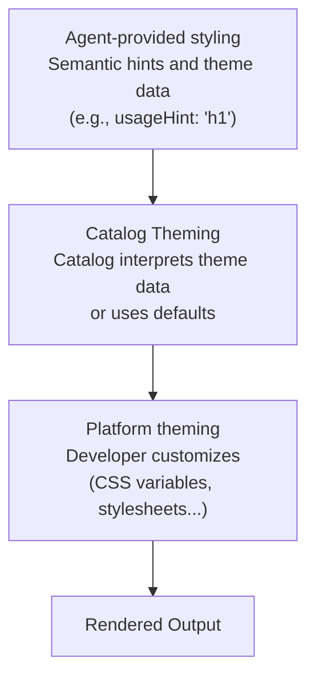

# Theming & Styling

Customize the look and feel of A2UI components to match your brand.

## The A2UI Styling Philosophy

A2UI follows a **renderer-controlled styling** approach by default, but allows for flexibility through catalogs:

- **Agents describe _what_ to show** (components and structure)
- **Renderers decide _how_ it looks** (colors, fonts, spacing)

However, the protocol is flexible enough to allow agents to influence styling when needed.

## Styling Layers

A2UI styling works in layers:



## Agent-provided styling information

### Semantic hints

Agents provide semantic hints (not visual styles) to guide rendering. In the _basic catalog_:

```json
{
  "id": "title",
  "component": {
    "Text": {
      "text": {"literalString": "Welcome"},
      "usageHint": "h1"
    }
  }
}
```

**Common `usageHint` values:**

- Text: `h1`, `h2`, `h3`, `h4`, `h5`, `body`, `caption`
- Other components have their own hints (see [Component Reference](../reference/components.md))

The catalog elements map these semantic hints to actual components on the target platform, and styles them.

### `theme` property

The A2UI protocol allows for an arbitrary `theme` property in the `createSurface` message. For now, this property is
defined as `z.any().optional()` in the Zod schema, meaning the agent can pass any JSON structure that the client
renderer and catalog understand.

- See the schema definition in [server-to-client.ts](../../renderers/web_core/src/v0_9/schema/server-to-client.ts).
- See the `Catalog` class and `themeSchema` in [catalog/types.ts](../../renderers/web_core/src/v0_9/catalog/types.ts).

**Note:** The _basic catalog_ components are not wired to use the `theme` coming from the agent.

_Want to influence this design? Chime in here: [#1118](https://github.com/google/A2UI/issues/1118)._

## Catalog theming

Theming is a responsibility of the catalog implementation. Each catalog can provide whatever theming solution it wants.
As an example, this is how the default _basic catalog_ does it:

### The Web Basic Catalog Theming

On the web, the _basic catalog_ provided by the default A2UI renderers is themed by overriding CSS variables.

Basic catalog components inject a small stylesheet with default values for these variables. The stylesheet targets
`:where(:root)` so their specificity is minimal, and the host app can override them easily.

For example, to override the primary color, you can simply add this to your app's CSS:

```css
:root {
  --a2ui-color-primary: #ff5722;
}
```

See the default styles in [default.ts](../../renderers/web_core/src/v0_9/basic_catalog/styles/default.ts).

**See some examples per-platform:**

- [Lit samples](../../samples/client/lit)
- [Angular samples](../../samples/client/angular)
- [React samples](../../samples/client/react)

### Per-component overrides

Beyond global theming, each component of the _basic catalog_ exposes custom variables to further refine its appearance.
For example, the `Card` component exposes a `--a2ui-card-background` variable.

Check the documentation of each component to see what variables it exposes.

## Common Styling Features

### Dark Mode

The default web renderers support automatic dark mode based on system preferences (`prefers-color-scheme`).

To always force dark or light mode (or to programmatically control switching), use the classnames `a2ui-light` or
`a2ui-dark` in an ancestor element of the generated code.

### Custom Fonts

Fonts can be loaded as in any other web application. The _basic catalog_ components attempt to inherit the font family
of their container, but offer two overridable values: `--a2ui-font-family-title` and `--a2ui-font-family-monospace` to
set a different font for headings and monospace text blocks.

## Flutter

Flutter has built-in theming support. See:

- [Use themes to share colors and font styles](https://docs.flutter.dev/cookbook/design/themes) from the Flutter docs.

## Best Practices

### 1. Use Semantic Hints, Not Visual Properties

When defining your components, agents should provide semantic hints (`usageHint`), never visual styles:

```json
// ✅ Good: Semantic hint
{
  "component": {
    "Text": {
      "text": {"literalString": "Welcome"},
      "usageHint": "h1"
    }
  }
}

// ❌ Bad: Visual properties (not supported)
{
  "component": {
    "Text": {
      "text": {"literalString": "Welcome"},
      "fontSize": 24,
      "color": "#FF0000"
    }
  }
}
```

### 2. Maintain Accessibility

- Ensure sufficient color contrast (WCAG AA: 4.5:1 for normal text, 3:1 for large text)
- Test with screen readers
- Support keyboard navigation
- Test in both light and dark modes

### 3. Use Design Tokens

Define reusable design tokens (colors, spacing, etc.) and reference them throughout your styles for consistency.

### 4. Test Across Platforms

- Test your theming on all target platforms (web, mobile, desktop)
- Verify both light and dark modes
- Check different screen sizes and orientations
- Ensure consistent brand experience across platforms

## Next Steps

- **[Defining Your Own Catalog](defining-your-own-catalog.md)**: Build custom components with your styling
- **[Component Reference](../reference/components.md)**: See styling options for all components
- **[Client Setup](client-setup.md)**: Set up the renderer in your app
